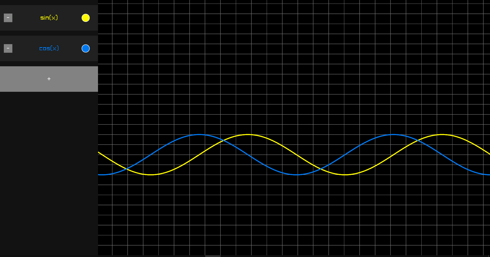
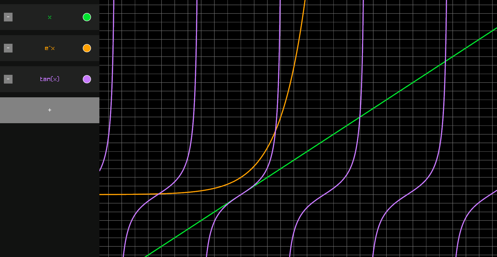

# GraPhi

A simple graphing calculator for visualizing math functions.





## Controls
Math Tab:
- Edit Text Fields - **Right Mouse Button**.

Graph:
- Move Camera - **WASD** 
- Zoom Camera - **Mouse Wheel** 

## Requirements
GraPhi requires OpenGL 3.3 support to be used. If your hardware does not support this version of OpenGL you can try to emulate it using something like [Mesa3D](https://www.mesa3d.org/).

## Build from Source
This project was developed using the [Odin Programming Language](https://github.com/odin-lang/Odin). So the Odin compiler must be installed and be available in the command line through the **PATH** environment variable.  

The recommended odin version is: [dev-2023-10](https://github.com/odin-lang/Odin/releases/tag/dev-2023-10)

If the compiler is installed and ready to use, you just need to run one of the following commands (run the commands that are specific to your platform):

### For Windows:

Command to build an optimized/release build:
```
.\build.bat release
```

Command to build a debug build:
```
.\build.bat debug
```

Command to delete files created in previous builds:
```
.\build.bat clean
```

### For Linux:
Builds on Linux have not been tested yet, but the following commands should work:

Command to build an optimized/release build:
```
odin build src -o:speed -out:graphi
```

Command to build a debug build:
```
odin build src -o:none -debug -out:graphi 
```
